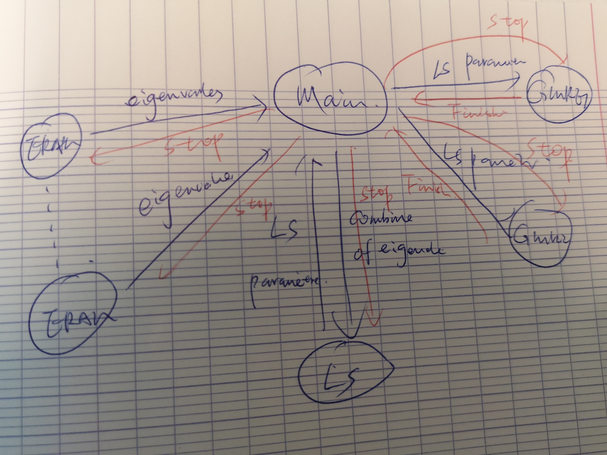

### Unite and Conquer Multiple GMRES/ERAM LS method implemented with MPI Spawn

Xinzhe WU @ Maison de la Simulation (xinzhe.wu@cea.fr)

Another similar implementation of [UCGLE](https://github.com/brunowu/UCGLE). The previous UCGLE uses a static MPI distributed communication implementation, thus the GMRES and ERAM Component numbers are fixed.

Here, we design a new dynamic distributed communication workflow by MPI_SPWAN. The Spawn functionality allows allocating multiple ERAM and GMRES Components. The multiple ERAM trends to be a [MERAM](https://epubs.siam.org/doi/10.1137/S1064827500366082)(Multiple Explicitly Restarted Arnoldi Method), the exchange of spectral information among the ERAM Components will improve the convergence of resolving no-Hermitian eigenvalue problems.

Meanwhile, multiple GMRES allows to solve simultaneously non-Hermitian linear systems with multiple right-hand sides. It is comparable with deflated [Block GMRES](http://www.sam.math.ethz.ch/~mhg/pub/delhipap.pdf), but with less global communication.

This software is underdevelopment by [Xinzhe Wu](https://brunowu.github.io/)...

##### Workflow

